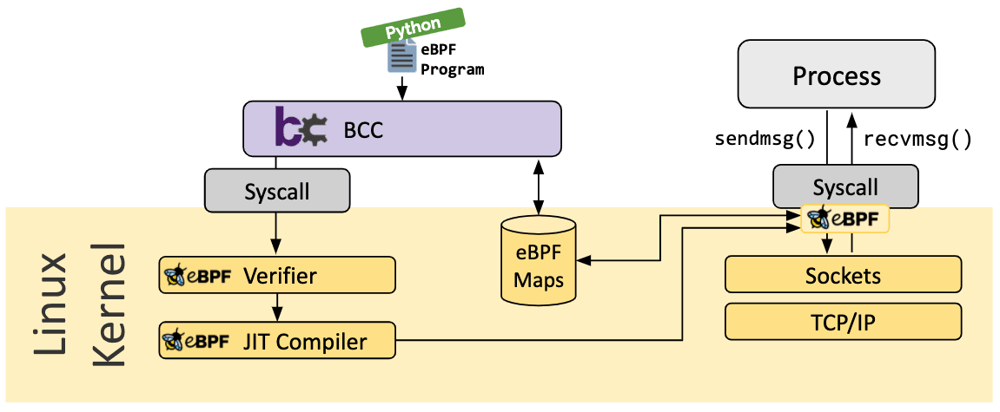

# `Linux BCC`

# 一、`Background`

`BCC`是一个框架，它允许用户编写`python`程序，并将`eBPF`程序嵌入其中。该框架主要用于应用程序和系统的分析/跟踪等场景，其中`eBPF`程序用于收集统计数据或生成事件，而用户空间中的对应程序收集数据并以易理解的形式展示。运行`python`程序将生成`eBPF`字节码并将其加载到内核中。`BCC`基本框架如下：


# 二、`compile`

```shell
git clone https://github.com/iovisor/bcc.git
mkdir bcc/build; cd bcc/build
cmake ..
make       #sudo apt-get install libpolly-16-dev
sudo make install
cmake -DPYTHON_CMD=python3 .. # build python3 binding
pushd src/python/
make
sudo make install
popd
```

编译完成后进行功能验证：
```shell
cd /usr/share/bcc/tools

jinsheng@jinsheng:/usr/share/bcc/tools$ sudo ./memleak -s 5
Attaching to kernel allocators, Ctrl+C to quit.
[04:25:49] Top 10 stacks with outstanding allocations:
	192 bytes in 1 allocations from stack
		0xffffffff88267387	kmem_cache_alloc_lru+0x267 [kernel]
		0xffffffff88267387	kmem_cache_alloc_lru+0x267 [kernel]
		0xffffffff88310f24	__d_alloc+0x34 [kernel]
		0xffffffff883142f6	d_alloc_pseudo+0x16 [kernel]
		0xffffffff882ef89e	alloc_file_pseudo+0x6e [kernel]
		0xffffffff8836173e	__anon_inode_getfile+0x8e [kernel]
		0xffffffff88361864	anon_inode_getfile+0x14 [kernel]
		0xffffffff881a61b7	__do_sys_perf_event_open+0x8a7 [kernel]
		0xffffffff881a6682	__x64_sys_perf_event_open+0x22 [kernel]
		0xffffffff87e06ce6	x64_sys_call+0x1426 [kernel]
		0xffffffff89017531	do_syscall_64+0x81 [kernel]
		0xffffffff89200130	entry_SYSCALL_64_after_hwframe+0x78 [kernel]
```
通过验证说明`BCC`已编译成功可以正常使用。
# 三、`DEMO`

以`hello_world.py`作为切入口理解各个模块
```python
# cat hello_world.py
#
#!/usr/bin/python
# Copyright (c) PLUMgrid, Inc.
# Licensed under the Apache License, Version 2.0 (the "License")

# run in project examples directory with:
# sudo ./hello_world.py"
# see trace_fields.py for a longer example

from bcc import BPF

# This may not work for 4.17 on x64, you need replace kprobe__sys_clone with kprobe____x64_sys_clone
BPF(text='int kprobe__sys_clone(void *ctx) { bpf_trace_printk("Hello, World!\\n"); return 0; }').trace_print()
```

执行输出结论：
```shell
root@jinsheng:/usr/share/bcc/examples# ./hello_world.py
b'           <...>-1895    [003] ...21 17226.231613: bpf_trace_printk: Hello, World!'
b''
b'            bash-1895    [003] ...21 17235.940026: bpf_trace_printk: Hello, World!'
```
针对信息进行分析：
- `text=''`:代表`BPF`程序本身，该模块常规情况采用`C`进行编写;加载该部分源码时需要通过`root`模式完成加载;
- `kprobe__sys_clone`：代表通过`kprobe`探针追踪观测`sys_clone`函数,此类函数命令规则：`kprobe__`加函数名即，举例说明：`kprobe__oom_kill_process`就遵循该规则;
- `bpf_trace_printk`:代表`BPF`输出`log`,该函数与`printf、printk`作用是类似的;`BPF`输出是多样的具体可以参考[bcc/docs/reference_guide.md at master · iovisor/bcc](https://github.com/iovisor/bcc/blob/master/docs/reference_guide.md) `Output`章节了解更多细节内容;
- `return 0`: `eBPF`程序必需的组成部分;
- `.trace_point()`：`BCC`进程会通过这个方式读取`trace_pipe`的内容并打印;

故此，`hello_world.py`代码的含义是通过`text=''`将`BPF`程序注入到内核并挂载到`clone`接口，追踪`sys_clone`在系统中是否发生系统调用，如果运行过程中有应用或进城调用`sys_clone`该函数则输出`Hello world!`。

**在`BCC`架构中自定义`BCC`程序：量化进程内存直接回收延迟情况**; 根据`hello_world.py`可知需要两个基本步骤：
- `python`编写`BPF`加载程序；
- `BPF`主程序完成加载，保证正常运行；

```python

from __future__ import print_function
from bcc import BPF
import sys

# load BPF program
bpf_text = """
#include <uapi/linux/ptrace.h>
#include <linux/sched.h>
#include <linux/mmzone.h>

struct val_t {
    u32 pid;
    u64 ts; // start time
    char name[TASK_COMM_LEN];
};

struct data_t {
    u32 pid;
    u64 nr_reclaimed;
    u64 delta;
    u64 ts;    // end time
    char name[TASK_COMM_LEN];
};

BPF_HASH(start, u32, struct val_t);
BPF_PERF_OUTPUT(events);

TRACEPOINT_PROBE(vmscan, mm_vmscan_direct_reclaim_begin) {
    struct val_t val = {};
    u32 pid = bpf_get_current_pid_tgid();

    if (bpf_get_current_comm(&val.name, sizeof(val.name)) == 0) {
        val.pid = pid;
        val.ts = bpf_ktime_get_ns();
        start.update(&pid, &val);
    }
    
    return 0;
}

TRACEPOINT_PROBE(vmscan, mm_vmscan_direct_reclaim_end) {
    u32 pid = bpf_get_current_pid_tgid();
    struct val_t *valp;
    struct data_t data = {};
    u64 ts = bpf_ktime_get_ns();

    valp = start.lookup(&pid);
    if (valp == NULL) {
        // missed entry
        return 0;
    }

    data.delta = ts - valp->ts;
    data.ts = ts / 1000;
    data.pid = valp->pid;
    bpf_probe_read_kernel(&data.name, sizeof(data.name), valp->name);
    data.nr_reclaimed = args->nr_reclaimed;

    events.perf_submit(args, &data, sizeof(data));
    start.delete(&pid);

    return 0;
}
"""

# initialize BPF
b = BPF(text=bpf_text)

# header
print("%-14s %-6s %8s %5s" %
      ("COMM", "PID", "LAT(ms)", "PAGES"), end="")
print("")

# process event
def print_event(cpu, data, size):
    event = b["events"].event(data)

    print("%-14.14s %-6s %8.2f %5d" %
          (event.name.decode('utf-8', 'replace'),
           event.pid,
           float(event.delta) / 1000000, event.nr_reclaimed), end="")
    print("")
    sys.stdout.flush()


# loop with callback to print_event
b["events"].open_perf_buffer(print_event, page_cnt=64)
while 1:
    try:
        b.perf_buffer_poll()
    except KeyboardInterrupt:
        exit()
```

运行该脚本并开辟`shell`执行`stress-ng`创造内存压力，查看输出信息：可以看到`stress-ng`申请内存过程中出发`direct_reclaim`并输出相关信息。
```shell
# ./jinsheng.py 
COMM           PID     LAT(ms) PAGES
stress-ng      52828      0.26    64
stress-ng      52826      0.34    64
stress-ng      52827      0.35    87
stress-ng      52827      8.79    43
stress-ng      52827      0.06    32
stress-ng      52827      0.12    64
stress-ng      52826     14.99    68
NetworkManager 603        8.56    75
stress-ng      52828     15.71    64
stress-ng      52826      0.08    64
stress-ng      52828      0.29    50
```
# 四、`Reference`

[IO Visor Project](https://github.com/iovisor)

[iovisor/bcc: BCC - Tools for BPF-based Linux IO analysis, networking, monitoring, and more](https://github.com/iovisor/bcc)