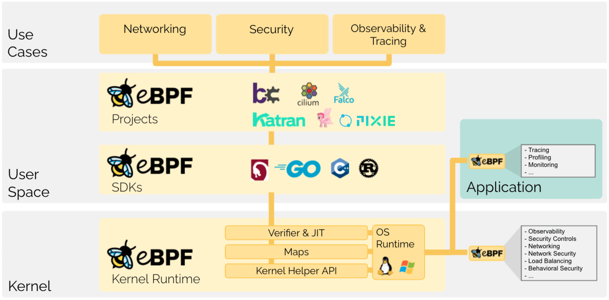
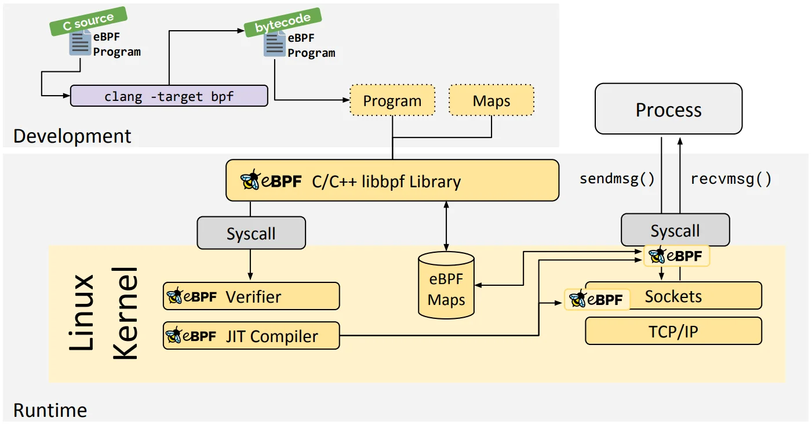
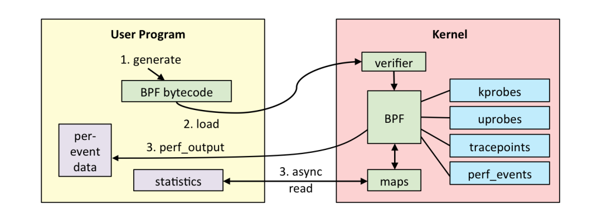
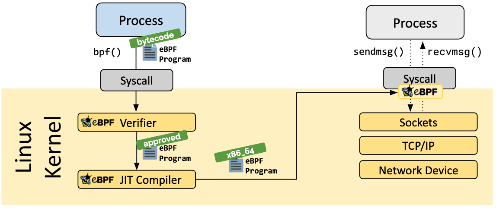
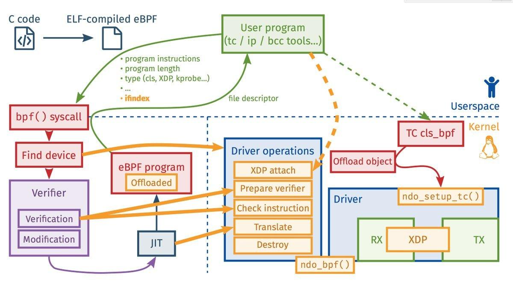

# `Linux eBPF`

# 一、`Background`

`eBPF(Extended Berkeley Packet Filter)`作为`BPF`技术的扩展及延伸,该技术早期应用在网路数据传输随着技术的发展逐渐应用到除网络之外的安全、性能诊断追踪等各个领域。



[eBPF](https://ebpf.io/)（扩展伯克利数据包过滤器）是一种强大而灵活的技术，允许在Linux内核中执行自定义字节码。eBPF最初是为数据包过滤而设计的，现已发展成为用于在内核空间中运行沙盒程序的通用基础设施。这些程序可以附加到各种钩子上，如网络事件、系统调用和跟踪点，使开发人员能够在不修改内核源代码的情况下扩展内核功能。这种能力使eBPF成为性能监控、安全执行和网络流量分析的多功能工具。本文重点介绍 `eBPF`在事件追踪、性能分析、可观测下角度详细介绍`eBPF`。

# 二、`Theory`

`eBPF`与传统的`kernel modules`机制是存在相似性，采用`kprobe、tracepoint`技术完成事件的追踪;但二者再设计原理上存在本质的差异，`eBPF`在不介入用户业务的情况下作为上帝视角监控整个系统，以沙盒程序的形式监控整个系统发生的各种事件。



**`eBPF`具备如下特性：**

- 兼容性：`eBPF`程序编译不依赖内核编译过程中的中间结果,通俗来讲内核重新编译后`eBPF`程序无需重新编译;
- 安全性：源码执行需要通过`Verifier`进行验证,保证`eBPF`程序不会导致系统崩溃等问题保证系统状态安全;
- 可移植性：编译一次可在任何地方运行无需重新编译,`eBPF`指令集、映射表结构、辅助函数和相关基础设施属于稳定`ABI`,故此在没有发生大版本更新的前提下`eBPF`程序可在多个设备中应用;
- 数据类型丰富性：通过`map`映射提供丰富的数据结构支持;

**`eBPF`程序运行宏观角度：**

- 用户态程序负责加载`eBPF`字节码至内核态,如果需要也会将内核态数据读取到用户态完成数据交互;
- 内核态`eBPF`字节码负责在内核中执行特定事件,如果需要通过`eBPF`特定输出方式完成数据交互将数据发送至用户态;

**`eBPF`程序运行详细流程：**

 1. `eBPF`源码编译为`eBPF`字节码,相关实现可以查询[bpf-helpers(7) - Linux manual page](https://man7.org/linux/man-pages/man7/bpf-helpers.7.html) 完成程序的开发及`eBPF`字节码的转换;
 2. `eBPF`字节码加载,加载`eBPF`字节码可以通过多种形式`C/C++、Python、GO`等等;
 3. `eBPF`字节码验证,保证`eBPF`字节码不会导致系统崩溃,不会引入不良因素导致系统异常;
 4. `eBPF JIT Compiler`,编译步骤将程序的通用字节码转换为机器特定的指令集，用以优化程序的执行速度。这使得 eBPF 程序可以像本地编译的内核代码或作为内核模块加载的代码一样高效地运行;

## `eBPF Bytecode`

`eBPF`执行程序与传统`C/C++`不同，需要通过`LLVM OR GCC`将`eBPF`程序转换为字节码,然后通过`bpf_load_program`将`eBPF`字节码加载到内核态`Verifier`完成验证。

- `eBPF` 通常不是直接使用，而是通过像 [Cilium](https://ebpf.io/projects/#cilium)、[bcc](https://ebpf.io/projects/#bcc) 或 [bpftrace](https://ebpf.io/projects/#bpftrace) 这样的项目间接使用，这些项目提供了`eBPF`之上的抽象，不需要直接编写程序，而是提供了指定基于意图的来定义实现的能力，然后用`eBPF` 实现。
- 如果不存在更高层次的抽象，则需要直接编写程序。`Linux `内核期望`eBPF`程序以字节码的形式加载。虽然直接编写字节码当然是可能的，但更常见的开发实践是利用像 [LLVM](https://llvm.org/) 这样的编译器套件将伪`c`代码编译成`eBPF `字节码。


**引申：`eBPF`源码为什么需要转换为`eBPF`字节码的形式加载到系统中，不能像`kernel_module`直接`insmod`插入内核码？**

- 可移植性：字节码是无关平台的,`eBPF`程序被编译为与平台无关的字节码格式,该字节码可以在不同架构(`X86、arm64`)上运行,而无需针对硬件进行重新编译。内核再通过`JIT`编译器将字节码转换为与架构匹配的机器码，从而实现高效执行的效果。
- 安全性：`eBPF`字节码在加载到内核之前会进行严格的验证器（`Verifier`）确保程序不会引入例如：内存非法访问、不会进入无限循环等异常。
- 灵活性：`eBPF`字节码是一种中间表达形式,可以通过用户态工具动态生成及加载,这种动态的开发模式允许开发人员及时调整程序逻辑无需重启系统或重新编译。在实际应用中也可以通过`BCC、BPFtrace`工具进行高效的灵活的开发。

## `Verifier`

`eBPF`程序被`clang`转换为`eBPF`字节码后，通过`bpf_load_program`将`eBPF`字节码从用户态拷贝到内核态，再通过`JIT`转化之前需要通过`Verifier`验证器进行检查,确保`eBPF`程序不会引入问题而导致系统异常，是一种提前检查机制保证了`eBPF` 程序运行的稳定性。



**`eBPF`安全性以下几点维护：**

- 加载 `eBPF` 程序的进程必须有所需的能力（特权）。除非启用非特权 `eBPF`，否则只有特权进程可以加载 `eBPF `程序。
- `eBPF`程序必须经过验证以确保它们始终运行到完成，例如一个`eBPF` 程序通常不会阻塞或永远处于循环中。`eBPF` 程序可能包含所谓的有界循环，但只有当验证器能够确保循环包含一个保证会变为真的退出条件时，程序才能通过验证。
- `eBPF`程序不能使用任何未初始化的变量或越界访问内存。
- `eBPF`程序必须符合系统的大小要求。不可能加载任意大的 `eBPF` 程序。
- `eBPF`程序必须具有有限的复杂性。验证器将评估所有可能的执行路径，并且必须能够在配置的最高复杂性限制范围内完成分析。

## `JIT(Just-in-Time) Compiler`

`eBPF`字节码完成`Verifier`验证后确认不存在会导致系统异常的问题保证系统的安全性。完成检测后需要通过`JIT`将通用的`eBPF`字节码转换为可以运行的机器码(指令集)确保程序能够正常运行，该过程是高效的与本地`kernel module`编译效率基本是一致的。

`JIT`编译器是现代编程语言的核心组件,负责在程序运行时将中间代码 (字节码)转换为机器可以识别的机器码,以提高代码的执行效率。程序运行过程中该编译器回检测执行的代码针对热点函数进行分析，完成确认后针对代码进行优化为后续程序的高效执行提供基础。在启动速度、内存占用、长期运行性能之间寻找平衡，提高程序的执行效率。

## `Run`

`eBPF`应用过程中需要确认`BPF`支持项`man bpf`以确保程序能够正常运行常规情况下可以通过`bpf helpers`详细确认该版本内核支持的事件，更好的完成开发。

# 三、`Source code`

`BPF`源码存放路径`linux/kernel/bpf`, 通过分析源码了解 `eBPF`底层实现机制,加深对`BPF`基础的理解。


# 四、`Verifier`

`eBPF`程序基础框架图,通过框架图可以了解开发`eBPF`程序时需要注意哪些事项、如何控制输出结果、如何实现自己既定的开发目标。



开发`eBPF`程序之前首先确认环境是否支持,确认响应的库文件及编译器是否安装：

- `clang` and `llvm` for compiling eBPF programs
- `libbpf` library
- `bpftool` command-line tool to inspect and manage BPF objects

如果不支持则需要安装相关工具及库：
```shell
sudo apt-get install clang llvm libbpf-dev
```

**创建`vmlinux.h`**

使用[bpftool](https://github.com/libbpf/bpftool)将vmlinux文件中的BTF（BPF类型格式）信息转储到名为`vmlinux.h`的C标头文件中。BTF是一种元数据格式，它描述了eBPF程序中使用的类型，使其更容易理解和调试这些程序。BTF信息对于eBPF程序理解内核中使用的数据结构和类型至关重要。

文件`/sys/kernel/btf/vmlinux`指定`BTF`数据的来源。`vmlinux`文件包含正在运行的内核的`BTF`信息。此文件通常由内核构建过程生成，包括所有内核数据结构的类型信息

```shell
bpftool btf dump file /sys/kernel/btf/vmlinux format c > vmlinux.h
```

`vmlinux.h`头文件可以包含在`eBPF`程序中，以促进其开发，并确保与内核数据结构的兼容性。使整个开发调试过程更轻松便捷。
## `Frist eBPF Demo`

基于`Python` 语言进行开发,故此需要完成两个文件代码开发工作：`eBPF`驱动程序开发、`eBPF`加载程序开发。

**<font color='red'>期望目标：当进程内存申请进入`direct reclaim`路径时,输出当前进程信息:`Name、Pid、Order、Nr_reclaimed、GFP`。</font>**

```python
from __future__ import print_function
from bcc import BPF
import sys

# load BPF program
bpf_text = """
#include <uapi/linux/ptrace.h>
#include <linux/sched.h>
#include <linux/mmzone.h>

struct val_t {
    u32 pid;
    u64 ts; // start time
    int order;
    u32 gfp_flags;
    char name[TASK_COMM_LEN];
};

struct data_t {
    u32 pid;
    u64 nr_reclaimed;
    u64 delta;
    u64 ts;    // end time
    int order;
    u32 gfp_flags;
    char name[TASK_COMM_LEN];
};

BPF_HASH(start, u32, struct val_t);
BPF_PERF_OUTPUT(events);

TRACEPOINT_PROBE(vmscan, mm_vmscan_direct_reclaim_begin) {
    struct val_t val = {};
    u32 pid = bpf_get_current_pid_tgid();

    if (bpf_get_current_comm(&val.name, sizeof(val.name)) == 0) {
        val.pid = pid;
        val.ts = bpf_ktime_get_ns();
        val.order = args->order;
        val.gfp_flags = args->gfp_flags;
        start.update(&pid, &val);
    }
    
    return 0;
}

TRACEPOINT_PROBE(vmscan, mm_vmscan_direct_reclaim_end) {
    u32 pid = bpf_get_current_pid_tgid();
    struct val_t *valp;
    struct data_t data = {};
    u64 ts = bpf_ktime_get_ns();

    valp = start.lookup(&pid);
    if (valp == NULL) {
        // missed entry
        return 0;
    }

    data.delta = ts - valp->ts;
    data.ts = ts / 1000;
    data.pid = valp->pid;
    data.order = valp->order;
    data.gfp_flags = valp->gfp_flags;
    bpf_probe_read_kernel(&data.name, sizeof(data.name), valp->name);
    data.nr_reclaimed = args->nr_reclaimed;

    events.perf_submit(args, &data, sizeof(data));
    start.delete(&pid);

    return 0;
}
"""

# initialize BPF
b = BPF(text=bpf_text)

# header
print("%-14s %-6s %8s %5s %5s %5s" %
      ("COMM", "PID", "LAT(ms)", "PAGES","ORDER", "GFP"), end="")
print("")

# process event
def print_event(cpu, data, size):
    event = b["events"].event(data)

    print("%-14.14s %-6s %8.2f %5d %5d   0x%X" %
          (event.name.decode('utf-8', 'replace'),
           event.pid,
           float(event.delta) / 1000000, event.nr_reclaimed, event.order, event.gfp_flags), end="")
    print("")
    sys.stdout.flush()


# loop with callback to print_event
b["events"].open_perf_buffer(print_event, page_cnt=64)
while 1:
    try:
        b.perf_buffer_poll()
    except KeyboardInterrupt:
        exit()
```

**`Output` 输出：** 通过`stress-ng`为系统创造内存压力,使系统进入低内存状态而进入`direct reclaim`流程。

```shell
$ sudo python3 direct_reclaim.py 
stress-ng      1863       1.29    64     0   0x140DCA
stress-ng      1859       0.32    64     0   0x140DCA
...
```

通过`ftrace`验证自定义开发`eBPF`程序输出结果是否正确：

```shell
root@jinsheng:/sys/kernel/tracing# cat trace_pipe | grep direct_reclaim
       stress-ng-1895    [002] .....  5040.758747: mm_vmscan_direct_reclaim_begin: order=0 gfp_flags=GFP_HIGHUSER_MOVABLE|__GFP_COMP|__GFP_ZERO
       stress-ng-1895    [002] .....  5040.758983: mm_vmscan_direct_reclaim_end: nr_reclaimed=64
       stress-ng-1895    [002] .....  5040.763241: mm_vmscan_direct_reclaim_begin: order=0 gfp_flags=GFP_HIGHUSER_MOVABLE|__GFP_COMP|__GFP_ZERO
       stress-ng-1895    [002] .....  5040.763411: mm_vmscan_direct_reclaim_end: nr_reclaimed=64
...
```

在`6.8.0-64-generic`环境中通过`ftrace、direct_reclaim.py`获取的`order、gfp_flags`数据是一致的说明自定义`BPF`工具没有问题。

## `eBPF & Perfetto`

众所周知[Perfetto UI](https://ui.perfetto.dev/)在`Android`系统中发挥至关重要的作用。常用于系统及应用性能分析过程中,熟练使用`Perfetto`对于性能相关问题的分析定位能够事半功倍。如何能将`eBPF`技术与`Perfetto`结合,将更加有效的拓展`Perfetto`技术边界辅助性能分析开发。


# 五、`Reference`

[eBPF 概览 | eBPF 指南](https://promacanthus.github.io/ebpf-docs/overview/)

[perf_event_open(2) - Linux manual page](https://man7.org/linux/man-pages/man2/perf_event_open.2.html)

[iovisor/bpf-docs: Presentations and docs](https://github.com/iovisor/bpf-docs)

[eBPF - Introduction, Tutorials & Community Resources](https://ebpf.io/zh-hans/)

[BPF and XDP Reference Guide — Cilium 1.17.6 documentation](https://docs.cilium.io/en/stable/reference-guides/bpf/index.html)

[什么是 eBPF ? An Introduction and Deep Dive into the eBPF Technology](https://ebpf.io/zh-hans/what-is-ebpf/)

[bpf « Documentation - kernel/git/torvalds/linux.git - Linux kernel source tree](https://web.git.kernel.org/pub/scm/linux/kernel/git/torvalds/linux.git/tree/Documentation/bpf/)


