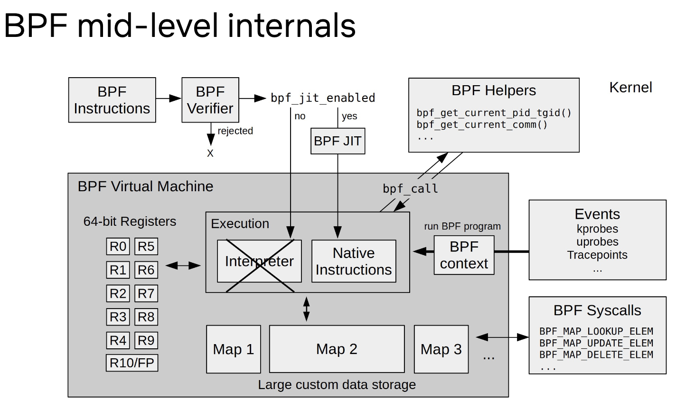
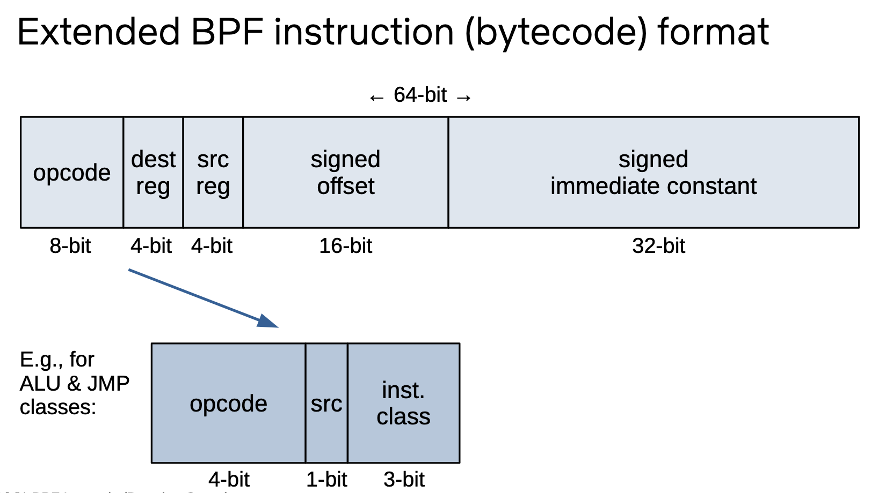
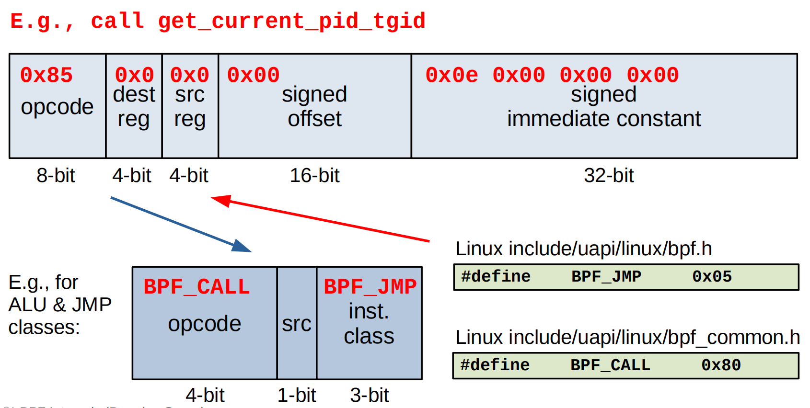
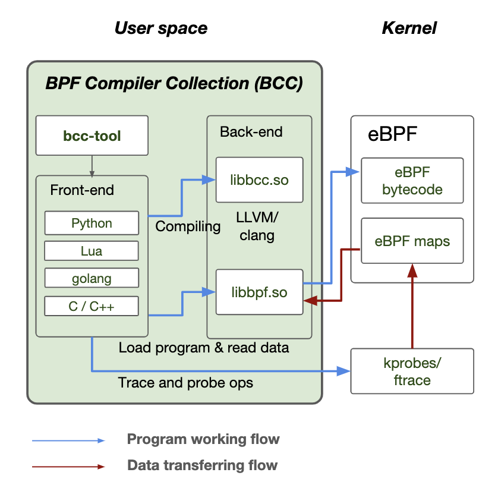

# `Linux eBPF`

# 一、`Background`

`eBPF(Extended Berkeley Packet Filter)`作为`BPF`技术的扩展及延伸,该技术早期应用在网路数据传输随着技术的发展逐渐应用到除网络之外的安全、性能诊断追踪等各个领域。


[eBPF](https://ebpf.io/)（扩展伯克利数据包过滤器）是一种强大而灵活的技术，允许在Linux内核中执行自定义字节码。eBPF最初是为数据包过滤而设计的，现已发展成为用于在内核空间中运行沙盒程序的通用基础设施。这些程序可以附加到各种钩子上，如网络事件、系统调用和跟踪点，使开发人员能够在不修改内核源代码的情况下扩展内核功能。这种能力使eBPF成为性能监控、安全执行和网络流量分析的多功能工具。本文重点介绍 `eBPF`在事件追踪、性能分析、可观测下角度详细介绍`eBPF`。

# 二、`Theory`

`eBPF`与传统的`kernel modules`机制是存在相似性，但二者再设计原理上存在本质的差异，`eBPF`在不介入用户业务的情况下作为上帝视角监控整个系统，以沙盒程序的形式监控整个系统发生的各种事件。


**`eBPF`具备如下特性：**

- 兼容性：`eBPF`程序编译不依赖内核编译过程中的中间结果,通俗来讲内核重新编译后`eBPF`程序无需重新编译;
- 安全性：源码执行需要通过`Verifier`进行验证,保证`eBPF`程序不会导致系统崩溃等问题保证系统状态安全;
- 可移植性：编译一次可在任何地方运行无需重新编译,`eBPF`指令集、映射表结构、辅助函数和相关基础设施属于稳定`ABI`,故此在没有发生大版本更新的前提下`eBPF`程序可在多个设备中应用;
- 数据类型丰富性：通过`map`映射提供丰富的数据结构支持;

**`eBPF`程序运行宏观角度：**

- 用户态程序负责加载`eBPF`字节码至内核态,如果需要也会将内核态数据读取到用户态完成数据交互;
- 内核态`eBPF`字节码负责在内核中执行特定事件,如果需要通过`eBPF`特定输出方式完成数据交互将数据发送至用户态;

**`eBPF`程序运行详细流程：**

 1. `eBPF`源码编译为`eBPF`字节码,相关实现可以查询[bpf-helpers(7) - Linux manual page](https://man7.org/linux/man-pages/man7/bpf-helpers.7.html) 完成程序的开发及`eBPF`字节码的转换;
 2. `eBPF`字节码加载,加载`eBPF`字节码可以通过多种形式`C/C++、Python、GO`等等;
 3. `eBPF`字节码验证,保证`eBPF`字节码不会导致系统崩溃,不会引入不良因素导致系统异常;
 4. `eBPF JIT Compiler`,编译步骤将程序的通用字节码转换为机器特定的指令集，用以优化程序的执行速度。这使得 eBPF 程序可以像本地编译的内核代码或作为内核模块加载的代码一样高效地运行;

## `eBPF Bytecode`

`eBPF`执行程序与传统`C/C++`不同，需要通过`LLVM OR GCC`将`eBPF`程序转换为字节码,然后通过`bpf_load_program`将`eBPF`字节码加载到内核态`Verifier`完成验证。

- `eBPF` 通常不是直接使用，而是通过像 [Cilium](https://ebpf.io/projects/#cilium)、[bcc](https://ebpf.io/projects/#bcc) 或 [bpftrace](https://ebpf.io/projects/#bpftrace) 这样的项目间接使用，这些项目提供了`eBPF`之上的抽象，不需要直接编写程序，而是提供了指定基于意图的来定义实现的能力，然后用`eBPF` 实现。
- 如果不存在更高层次的抽象，则需要直接编写程序。`Linux `内核期望`eBPF`程序以字节码的形式加载。虽然直接编写字节码当然是可能的，但更常见的开发实践是利用像 [LLVM](https://llvm.org/) 这样的编译器套件将伪`c`代码编译成`eBPF `字节码。


**引申：`eBPF`源码为什么需要转换为`eBPF`字节码的形式加载到系统中，不能像`kernel_module`直接`insmod`插入内核码？**

- 可移植性：字节码是无关平台的,`eBPF`程序被编译为与平台无关的字节码格式,该字节码可以在不同架构(`X86、arm64`)上运行,而无需针对硬件进行重新编译。内核再通过`JIT`编译器将字节码转换为与架构匹配的机器码，从而实现高效执行的效果。
- 安全性：`eBPF`字节码在加载到内核之前会进行严格的验证器（`Verifier`）确保程序不会引入例如：内存非法访问、不会进入无限循环等异常。
- 灵活性：`eBPF`字节码是一种中间表达形式,可以通过用户态工具动态生成及加载,这种动态的开发模式允许开发人员及时调整程序逻辑无需重启系统或重新编译。在实际应用中也可以通过`BCC、BPFtrace`工具进行高效的灵活的开发。

## `Verifier`

`eBPF`程序被`clang`转换为`eBPF`字节码后，通过`bpf_load_program`将`eBPF`字节码从用户态拷贝到内核态，再通过`JIT`转化之前需要通过`Verifier`验证器进行检查,确保`eBPF`程序不会引入问题而导致系统异常，是一种提前检查机制保证了`eBPF` 程序运行的稳定性。验证器设计参考：`kernel/bpf/verifier.c`代码。


**`eBPF`安全性以下几点维护：**

- 加载 `eBPF` 程序的进程必须有所需的能力（特权）。除非启用非特权 `eBPF`，否则只有特权进程可以加载 `eBPF `程序。
- `eBPF`程序必须经过验证以确保它们始终运行到完成，例如一个`eBPF` 程序通常不会阻塞或永远处于循环中。`eBPF` 程序可能包含所谓的有界循环，但只有当验证器能够确保循环包含一个保证会变为真的退出条件时，程序才能通过验证。
- `eBPF`程序不能使用任何未初始化的变量或越界访问内存。
- `eBPF`程序必须符合系统的大小要求。不可能加载任意大的 `eBPF` 程序。
- `eBPF`程序必须具有有限的复杂性。验证器将评估所有可能的执行路径，并且必须能够在配置的最高复杂性限制范围内完成分析。

## `JIT(Just-in-Time) Compiler`

`eBPF`字节码完成`Verifier`验证后确认不存在会导致系统异常的问题保证系统的安全性。完成检测后需要通过`JIT`将通用的`eBPF`字节码转换为可以运行的机器码(指令集)确保程序能够正常运行，该过程是高效的与本地`kernel module`编译效率基本是一致的。

`JIT`编译器是现代编程语言的核心组件,负责在程序运行时将中间代码 (字节码)转换为机器可以识别的机器码,以提高代码的执行效率。程序运行过程中该编译器回检测执行的代码针对热点函数进行分析，完成确认后针对代码进行优化为后续程序的高效执行提供基础。在启动速度、内存占用、长期运行性能之间寻找平衡，提高程序的执行效率。

## `Run`

`eBPF`应用过程中需要确认`BPF`支持项`man bpf`以确保程序能够正常运行常规情况下可以通过`bpf helpers`详细确认该版本内核支持的事件，更好的完成开发。
# 三、`Source code`

`BPF`源码存放路径`linux/kernel/bpf`, 通过分析源码了解 `eBPF`底层实现机制,加深对`BPF`基础的理解。

`eBPF`本质是一个基于`RISC`寄存器的虚拟机，使用自定义的`64 bit RISC`指令集，能够在`Linux`内核内运行即时本地编译的 "BPF 程序"，并能访问内核功能和内存的一个子集。`eBPF`共有`r0 ~ r10`11个64位寄存器,一个程序计数器和一个`512`字节固定大小的堆栈。九个寄存器是通用读写的，一个是只读堆栈指针，程序计数器是隐式的，即我们只能跳转到计数器的某个偏移量。



```c
/* Register numbers */
enum {
	BPF_REG_0 = 0,
	BPF_REG_1,
	BPF_REG_2,
	BPF_REG_3,
	BPF_REG_4,
	BPF_REG_5,
	BPF_REG_6,
	BPF_REG_7,
	BPF_REG_8,
	BPF_REG_9,
	BPF_REG_10,
	__MAX_BPF_REG,
};

/* BPF has 10 general purpose 64-bit registers and stack frame. */
#define MAX_BPF_REG	__MAX_BPF_REG
```

寄存器`r10`是唯一只读的寄存器，其中包含帧指针地址，以便访问`BPF`堆栈空间。剩余的`r0`-`r9`寄存器是通用的，具有读/写性质。`BPF`程序可以调用预定义的帮助函数，该函数由核心内核定义（从不由模块定义）。`BPF`调用惯例定义如下：
- `r0`包含帮助函数调用的返回值。
- `r1`- `r5`持有从`BPF`程序到内核帮助函数的参数。
- `r6`- `r9`是被调用者保存的寄存器，将在帮助函数调用时保留。

在程序加载时提供的`eBPF` [程序类型](https://github.com/torvalds/linux/blob/v6.16/include/uapi/linux/bpf.h)准确地决定了哪些内核函数子集可以调用，以及在程序启动时通过 `r1`提供的 "上下文"参数。`r0` 中存储的程序退出值的含义也是由程序类型决定的。
每个函数调用在寄存器 `r1 - r5 `中最多可以有`5`个参数；这适用于 `eBPF `到` eBPF` 和内核函数的调用。寄存器`r1 - r5`只能存储数字或指向堆栈的指针（作为参数传递给函数），从不直接指向任意内存的指针。所有内存访问都必须先将数据加载到 `eBPF`堆栈中，然后才能在 `eBPF` 程序中使用它。此限制有助于 `eBPF `验证器，它简化了内存模型以实现更轻松的正确性检查。类似的函数定义如下：

```c
u64 fn(u64 r1, u64 r2, u64 r3, u64 r4, u64 r5)
```

`eBPF`程序运行需要将`eBPF`字节码转换为机器可以运行的指令，而`eBPF`运行指令也是64位指令结构如下图所示：

```c
struct bpf_insn {
	__u8	code;		/* opcode */
	__u8	dst_reg:4;	/* dest register */
	__u8	src_reg:4;	/* source register */
	__s16	off;		/* signed offset */
	__s32	imm;		/* signed immediate constant */
};
```



```c
/* Instruction classes */
#define BPF_CLASS(code) ((code) & 0x07)
#define		BPF_LD		0x00
#define		BPF_LDX		0x01
#define		BPF_ST		0x02
#define		BPF_STX		0x03
#define		BPF_ALU		0x04
#define		BPF_JMP		0x05
#define		BPF_RET		0x06
#define		BPF_MISC    0x07
```

指令整体被分为`8`大类，针对每种类型的指令都有不同的描述。在`BPF`程序开发中指令通常以组合的形式进行使用，例如函数调用结构组成如下：

```c
/* Convert function address to BPF immediate */

#define BPF_CALL_IMM(x)	((void *)(x) - (void *)__bpf_call_base)

#define BPF_EMIT_CALL(FUNC)					\
	((struct bpf_insn) {					\
		.code  = BPF_JMP | BPF_CALL,			\
		.dst_reg = 0,					\
		.src_reg = 0,					\
		.off   = 0,					\
		.imm   = BPF_CALL_IMM(FUNC) })
```

我们以常见的`bpf_get_current_pid_tgid`函数分析该函数在应用指令是如何实现的。 需要明确：该代码随手而写，目的在于理解`BPF` 函数调用指令，代码可能无法执行。

```c
#include <linux/bpf.h>  // 1
#include <bpf/bpf_helpers.h>

unsigned int pid = 0;  // 2

SEC("xdp")  // 3
int hello(struct xdp_md *ctx) {  // 4
	pid = bpf_get_current_pid_tgid();
    bpf_printk("Hello World %d", pid);
    return XDP_PASS;
}

char LICENSE[] SEC("license") = "Dual BSD/GPL";  // 5
```

**编译`bpf`源码后进行反汇编操作：**

```shell
$ clang -g -O2 -target bpf -I/user/include/x86_64-linux-gen -c hello.bpf.c -o hello.bpf.o

$ file hello.bpf.o
hello.bpf.o: ELF 64-bit LSB relocatable, eBPF, version 1 (SYSV), with debug_info, not stripped
$ llvm-objdump-12 -S hello.bpf.o

hello.bpf.o:	file format elf64-bpf


Disassembly of section xdp:

0000000000000000 <hello>:
; 	pid = bpf_get_current_pid_tgid();
       0:	85 00 00 00 0e 00 00 00	call 14
       1:	18 01 00 00 00 00 00 00 00 00 00 00 00 00 00 00	r1 = 0 ll
       3:	63 01 00 00 00 00 00 00	*(u32 *)(r1 + 0) = r0
       4:	b7 01 00 00 00 00 00 00	r1 = 0
;     bpf_printk("Hello World %d", pid);
       5:	73 1a fe ff 00 00 00 00	*(u8 *)(r10 - 2) = r1
       6:	b7 01 00 00 25 64 00 00	r1 = 25637
       7:	6b 1a fc ff 00 00 00 00	*(u16 *)(r10 - 4) = r1
       8:	b7 01 00 00 72 6c 64 20	r1 = 543452274
       9:	63 1a f8 ff 00 00 00 00	*(u32 *)(r10 - 8) = r1
      10:	18 01 00 00 48 65 6c 6c 00 00 00 00 6f 20 57 6f	r1 = 8022916924116329800 ll
      12:	7b 1a f0 ff 00 00 00 00	*(u64 *)(r10 - 16) = r1
      13:	bf a1 00 00 00 00 00 00	r1 = r10
      14:	07 01 00 00 f0 ff ff ff	r1 += -16
;     bpf_printk("Hello World %d", pid);
      15:	b7 02 00 00 0f 00 00 00	r2 = 15
      16:	bf 03 00 00 00 00 00 00	r3 = r0
      17:	85 00 00 00 06 00 00 00	call 6
;     return XDP_PASS;
      18:	b7 00 00 00 02 00 00 00	r0 = 2
      19:	95 00 00 00 00 00 00 00	exit
```

可以看到`bpf_get_current_pid_tgid`对应的指令 **`85 00 00 00 0e 00 00 00	call 14`**

```c
#define ___BPF_FUNC_MAPPER(FN, ctx...)			\
	FN(unspec, 0, ##ctx)				\
	FN(map_lookup_elem, 1, ##ctx)			\
	FN(map_update_elem, 2, ##ctx)			\
	FN(map_delete_elem, 3, ##ctx)			\
	FN(probe_read, 4, ##ctx)			\
	FN(ktime_get_ns, 5, ##ctx)			\
	FN(trace_printk, 6, ##ctx)			\
	...
	FN(get_current_pid_tgid, 14, ##ctx)		\
```

**`0x0e`代表：`get_current_pid_tgid`,`0x85`代表：`BPF_CALL|BPF_JMP`**。

```c
//linux/include/uapi/linux/bpf.h
#define BPF_CALL    0x80    /* function call */
//linux/include/uapi/bpf_common.h
#define     BPF_JMP     0x05
```

详细参考[[Linux eBPF Instructions]]。

# 四、`Verifier`

`eBPF`程序基础框架图,通过框架图可以了解开发`eBPF`程序时需要注意哪些事项、如何控制输出结果、如何实现自己既定的开发目标。


开发`eBPF`程序之前首先确认环境是否支持,确认响应的库文件及编译器是否安装：

- `clang` and `llvm` for compiling eBPF programs
- `libbpf` library
- `bpftool` command-line tool to inspect and manage BPF objects

如果不支持则需要安装相关工具及库：
```shell
sudo apt-get install clang llvm libbpf-dev
```

**创建`vmlinux.h`**

使用[bpftool](https://github.com/libbpf/bpftool)将vmlinux文件中的BTF（BPF类型格式）信息转储到名为`vmlinux.h`的C标头文件中。BTF是一种元数据格式，它描述了eBPF程序中使用的类型，使其更容易理解和调试这些程序。BTF信息对于eBPF程序理解内核中使用的数据结构和类型至关重要。

文件`/sys/kernel/btf/vmlinux`指定`BTF`数据的来源。`vmlinux`文件包含正在运行的内核的`BTF`信息。此文件通常由内核构建过程生成，包括所有内核数据结构的类型信息

```shell
bpftool btf dump file /sys/kernel/btf/vmlinux format c > vmlinux.h
```

`vmlinux.h`头文件可以包含在`eBPF`程序中，以促进其开发，并确保与内核数据结构的兼容性。使整个开发调试过程更轻松便捷。
## `Frist eBPF Demo`

正常情况下需要开发`eBPF`驱动程序、`eBPF`加载程序;此处为简化开发过程基于`BCC`框架通过`Python`语言进行开发实现。`BCC`基础组成框架如下图：


**<font color='red'>期望目标：当进程内存申请进入`direct reclaim`路径时,输出当前进程信息:`Name、Pid、Order、Nr_reclaimed、GFP`。</font>**

```python
from __future__ import print_function
from bcc import BPF
import sys

# load BPF program
bpf_text = """
#include <uapi/linux/ptrace.h>
#include <linux/sched.h>
#include <linux/mmzone.h>

struct val_t {
    u32 pid;
    u64 ts; // start time
    int order;
    u32 gfp_flags;
    char name[TASK_COMM_LEN];
};

struct data_t {
    u32 pid;
    u64 nr_reclaimed;
    u64 delta;
    u64 ts;    // end time
    int order;
    u32 gfp_flags;
    char name[TASK_COMM_LEN];
};

BPF_HASH(start, u32, struct val_t);
BPF_PERF_OUTPUT(events);

TRACEPOINT_PROBE(vmscan, mm_vmscan_direct_reclaim_begin) {
    struct val_t val = {};
    u32 pid = bpf_get_current_pid_tgid();

    if (bpf_get_current_comm(&val.name, sizeof(val.name)) == 0) {
        val.pid = pid;
        val.ts = bpf_ktime_get_ns();
        val.order = args->order;
        val.gfp_flags = args->gfp_flags;
        start.update(&pid, &val);
    }
    
    return 0;
}

TRACEPOINT_PROBE(vmscan, mm_vmscan_direct_reclaim_end) {
    u32 pid = bpf_get_current_pid_tgid();
    struct val_t *valp;
    struct data_t data = {};
    u64 ts = bpf_ktime_get_ns();

    valp = start.lookup(&pid);
    if (valp == NULL) {
        // missed entry
        return 0;
    }

    data.delta = ts - valp->ts;
    data.ts = ts / 1000;
    data.pid = valp->pid;
    data.order = valp->order;
    data.gfp_flags = valp->gfp_flags;
    bpf_probe_read_kernel(&data.name, sizeof(data.name), valp->name);
    data.nr_reclaimed = args->nr_reclaimed;

    events.perf_submit(args, &data, sizeof(data));
    start.delete(&pid);

    return 0;
}
"""

# initialize BPF
b = BPF(text=bpf_text)

# header
print("%-14s %-6s %8s %5s %5s %5s" %
      ("COMM", "PID", "LAT(ms)", "PAGES","ORDER", "GFP"), end="")
print("")

# process event
def print_event(cpu, data, size):
    event = b["events"].event(data)

    print("%-14.14s %-6s %8.2f %5d %5d   0x%X" %
          (event.name.decode('utf-8', 'replace'),
           event.pid,
           float(event.delta) / 1000000, event.nr_reclaimed, event.order, event.gfp_flags), end="")
    print("")
    sys.stdout.flush()


# loop with callback to print_event
b["events"].open_perf_buffer(print_event, page_cnt=64)
while 1:
    try:
        b.perf_buffer_poll()
    except KeyboardInterrupt:
        exit()
```

**`Output` 输出：** 通过`stress-ng`为系统创造内存压力,使系统进入低内存状态而进入`direct reclaim`流程。

```shell
# python3 direct_reclaim.py
COMM           PID     LAT(ms) PAGES ORDER   GFP
stress-ng      2510       0.16    40     0   0x140DCA
stress-ng      2510       0.10    64     0   0x140DCA
stress-ng      2514       0.20    82     0   0x140DCA
stress-ng      2514       0.06    64     0   0x140DCA
...
```

通过`ftrace`验证自定义开发`eBPF`程序输出结果是否正确：

```shell
root@jinsheng:/sys/kernel/tracing# cat trace_pipe | grep direct_reclaim
       stress-ng-1895    [002] .....  5040.758747: mm_vmscan_direct_reclaim_begin: order=0 gfp_flags=GFP_HIGHUSER_MOVABLE|__GFP_COMP|__GFP_ZERO
       stress-ng-1895    [002] .....  5040.758983: mm_vmscan_direct_reclaim_end: nr_reclaimed=64
       stress-ng-1895    [002] .....  5040.763241: mm_vmscan_direct_reclaim_begin: order=0 gfp_flags=GFP_HIGHUSER_MOVABLE|__GFP_COMP|__GFP_ZERO
       stress-ng-1895    [002] .....  5040.763411: mm_vmscan_direct_reclaim_end: nr_reclaimed=64
...
```

在`6.8.0-64-generic`环境中通过`ftrace、direct_reclaim.py`获取的`order、gfp_flags`数据是一致的说明自定义`BPF`工具没有问题。

# 五、`Reference`

[eBPF 概览 | eBPF 指南](https://promacanthus.github.io/ebpf-docs/overview/)

[perf_event_open(2) - Linux manual page](https://man7.org/linux/man-pages/man2/perf_event_open.2.html)

[iovisor/bpf-docs: Presentations and docs](https://github.com/iovisor/bpf-docs)

[eBPF - Introduction, Tutorials & Community Resources](https://ebpf.io/zh-hans/)

[BPF and XDP Reference Guide — Cilium 1.17.6 documentation](https://docs.cilium.io/en/stable/reference-guides/bpf/index.html)

[什么是 eBPF ? An Introduction and Deep Dive into the eBPF Technology](https://ebpf.io/zh-hans/what-is-ebpf/)

[bpf « Documentation - kernel/git/torvalds/linux.git - Linux kernel source tree](https://web.git.kernel.org/pub/scm/linux/kernel/git/torvalds/linux.git/tree/Documentation/bpf/)


